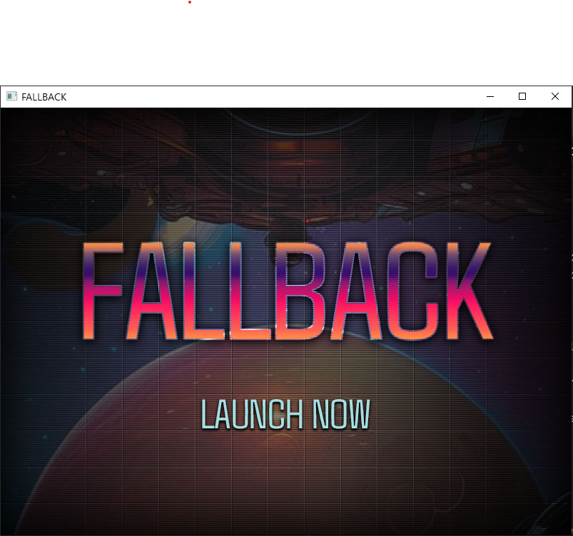
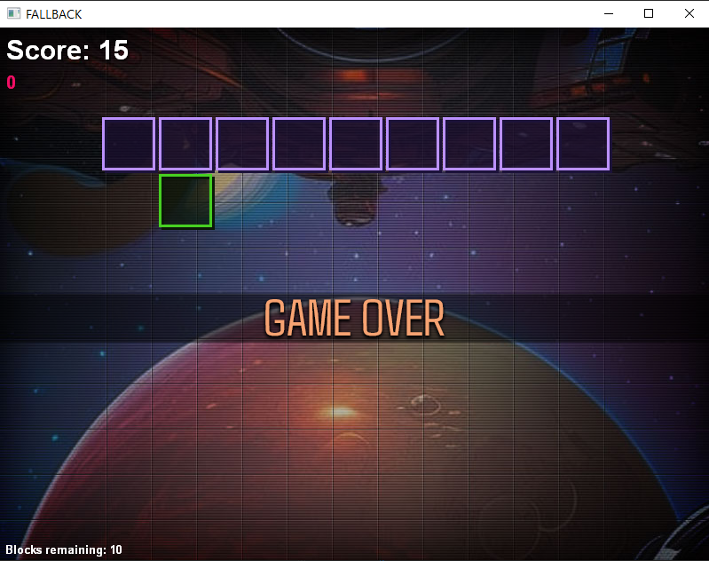

# My C++ Breakout (called Fallback)

My first game in C++/DirectX!

## About 

Book: [Programming 2D Games by Charles Kelly](http://www.programming2dgames.com//)

Chapter 6 Challenge: Given the engine so far, make a game, any game. Keep it simple.

I chose to make a simple form of Breakout.

**Features:**

* game loop (initialization, input, render, restart, level progression, score)
* collision detection
* game logic: ball resets if missed, blocks disappear when hit, levels can be restarted, game keeps score

## Learnings

I'll note that the content is quite old (circa 2012) so I had to convert the code in the book and examples a bit to get it working on Windows 10. The biggest challenge was getting all the DirectX9 parts needed set up in the includes and linker settings.

* Learned the basics of Win32 (and WinRT) apps are set up and initialized
* Learned a ton about VS and how to work within it including the debugger
* Win32 apps don't have a built in log like other environments - the debugger is absolutely critical
* I have a very solid understanding of how all the pieces fit together in this engine and the things that need to be accounted for in any game engine
* I can see how the organization of the components so far will be a serious problem on a project that is much larger than this tiny game

## Proud Of

I'm proud of working through 2 blocking type bugs which stopped me in my tracks. But I kept at it and worked passed them. 

I could easily take this further but need to move on.

## Additions

I went back a few times to add the following:

- Audio/SFX
- Score tracking
- Added Block types which have varying health and associated colors with their remaining health
- Console class and log display
- Level progressions
- UI Buttons
- Title screen, game over (state management)

