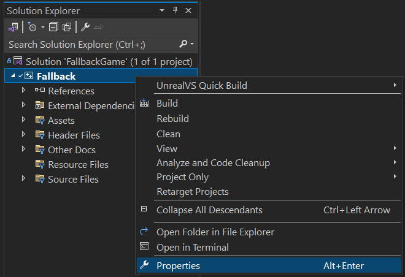
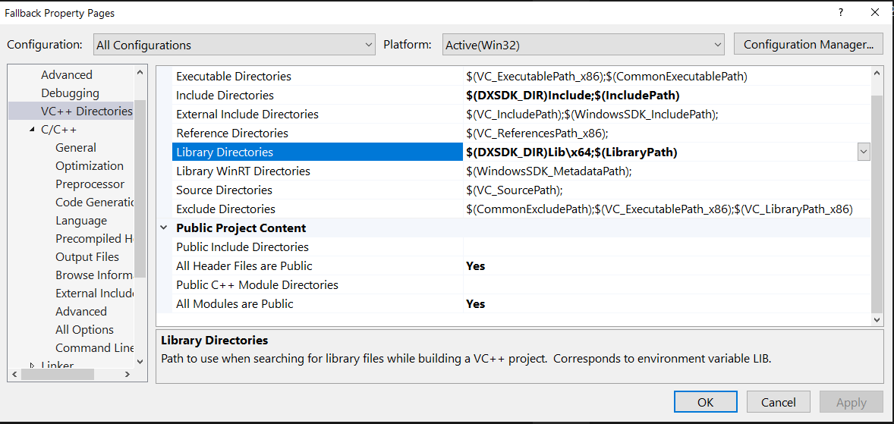
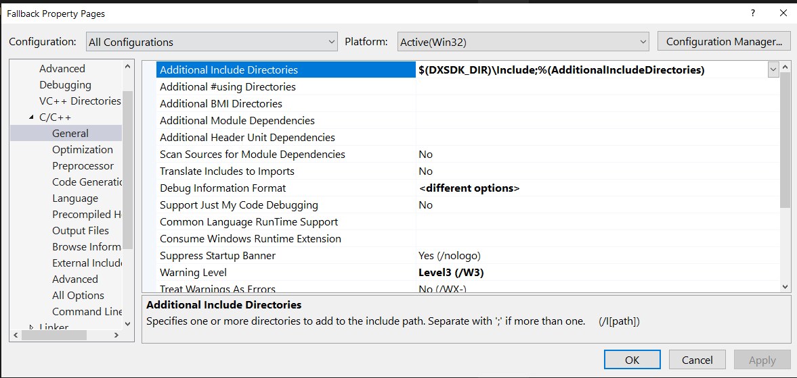
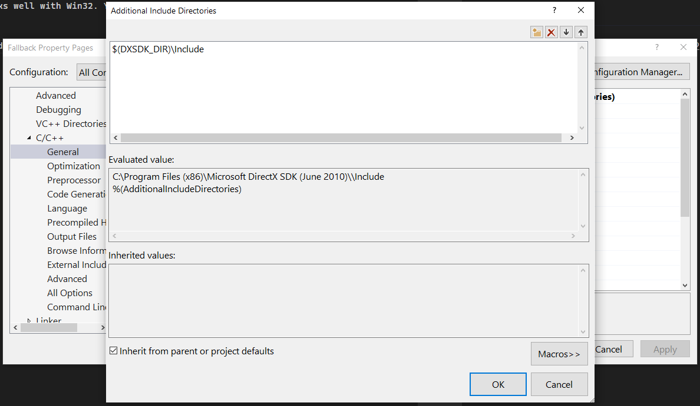
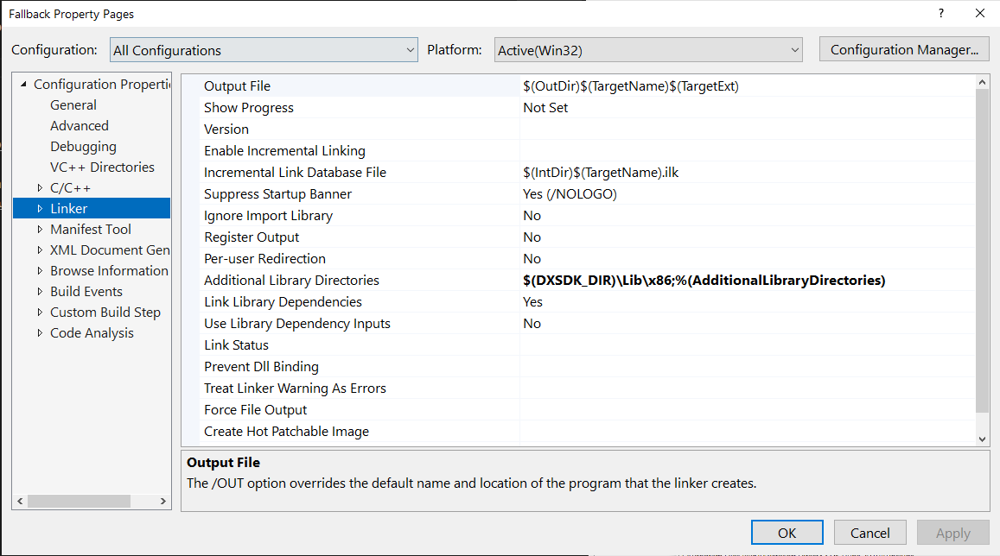

# Code Set-up

The code is based off an older book, so the project targets the Win32 runtime and utilizies DirectX9 for graphics and the XACT audio engine for sounds. Xact will come with DX9 SDK, so all you need to do is to install the DX9 SDK.

## Install DX9 SDK

DX9 is quite old but still works well with Win32. To get the SDK, you'll need to find and install the `Microsoft DirectX SDK (June 2010)`.

Once installed, you need to update the C/C++ Include and Library directories to make sure you're including the parts of the SDK you need.

In case you're new to Visual Studio, right-click on the Fallback "project" and select Properties to find these settings.

Here are the paths I used based on my SDK path of `C:\Program Files (x86)\Microsoft DirectX SDK (June 2010)\`

Project Menu:

VC++ Directories:

C/C++ General pane:

C/C++ Additional Include Directories and what it evalutes to:

Linker General pane:

